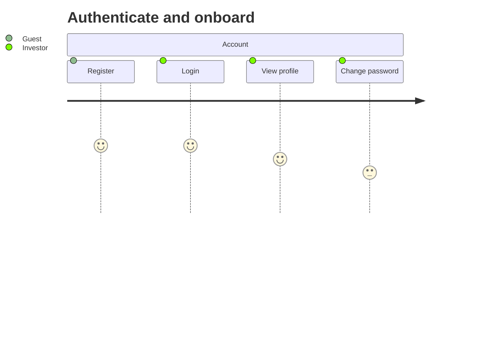
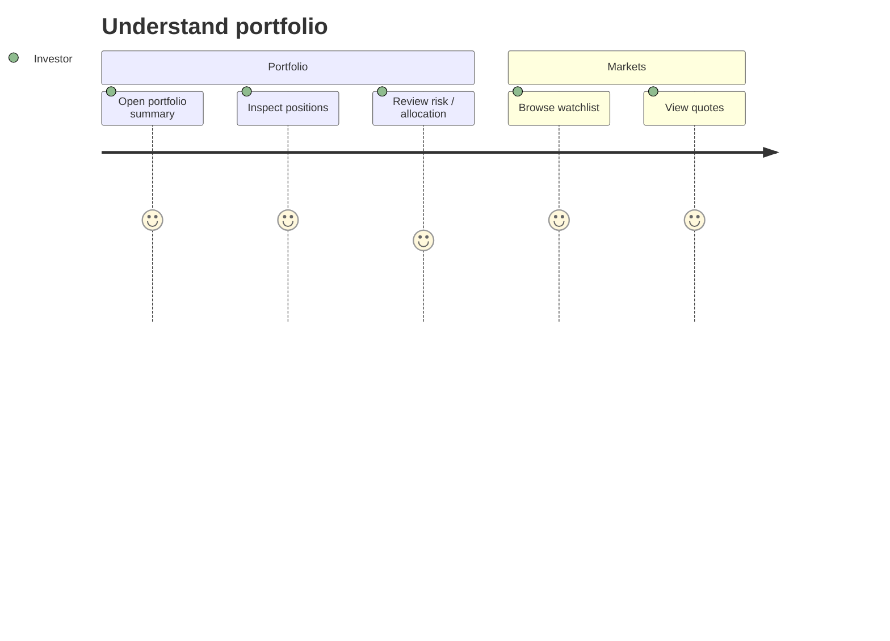
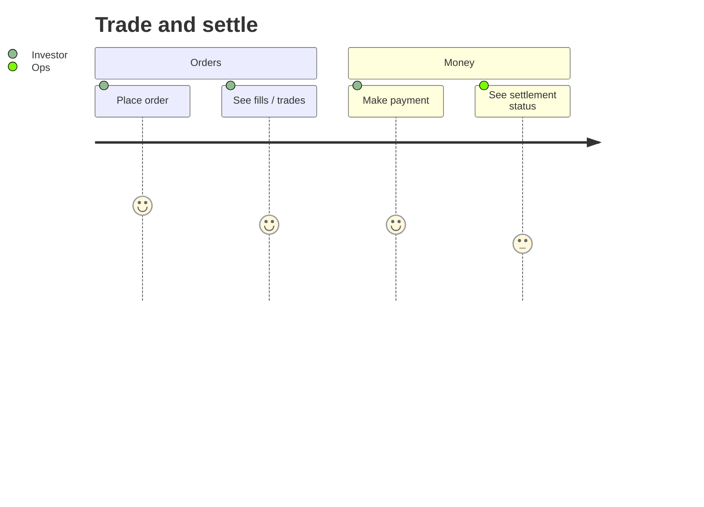
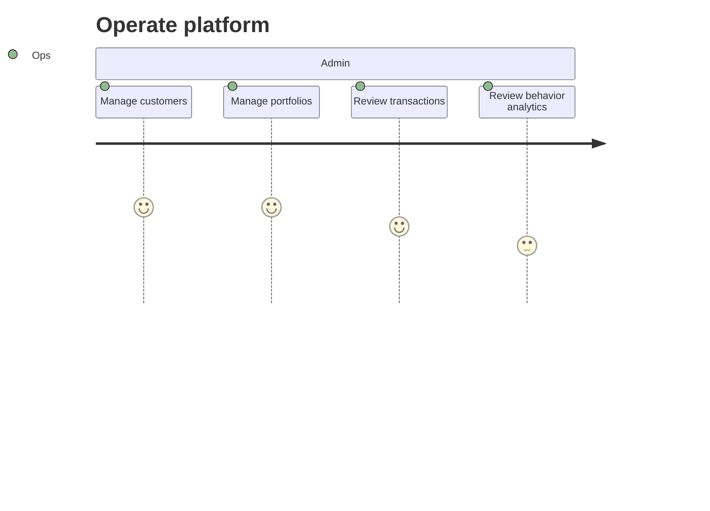

# User Story Map — FinPulse

> Jeff Patton story map + Mermaid journeys + GWT epics in files.  
> Story bodies and acceptance criteria live under [user-stories/](./user-stories/); this page is the index (single source).

## Personas

| Role | Description |
| ---- | ----------- |
| Investor | Uses portal / mobile for portfolio, watchlists, quotes, payments |
| Advisor / Ops | Uses admin to manage customers, accounts, portfolios, transactions |
| Guest / new user | Registers and authenticates |
| Developer | Seeds data, runs local stack, extends APIs |

## Journey overview

### Authenticate and onboard

### Understand portfolio

### Trade and settle

### Operate (Admin)

---

## Backbone map

| Auth | Customers & accounts | Instruments & markets | Portfolios | Watchlists & quotes | Trading | Payments | Analytics | Surfaces |
| ---- | -------------------- | --------------------- | ---------- | ------------------- | ------- | -------- | --------- | -------- |
| [E1](./user-stories/E1-auth.md) | [E2](./user-stories/E2-customers-accounts.md) | [E3](./user-stories/E3-instruments-markets.md) | [E4](./user-stories/E4-portfolios-positions.md) | [E5](./user-stories/E5-watchlists-quotes.md) | [E6](./user-stories/E6-orders-trades.md) | [E7](./user-stories/E7-payments-settlements.md) | [E8](./user-stories/E8-analytics-risk.md) | [E9](./user-stories/E9-admin-portal-mobile.md) |

| Bonds & options | Blockchain demo |
| --------------- | --------------- |
| [E10](./user-stories/E10-bonds-options.md) | [E11](./user-stories/E11-blockchain-demo.md) |

## Related

- [Glossary](../Glossary.md)
- [API](../developer/api.md)
- [C4](../developer/c4-model/)
